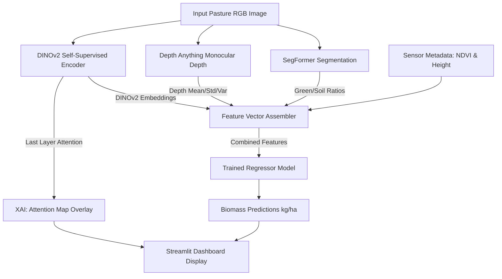
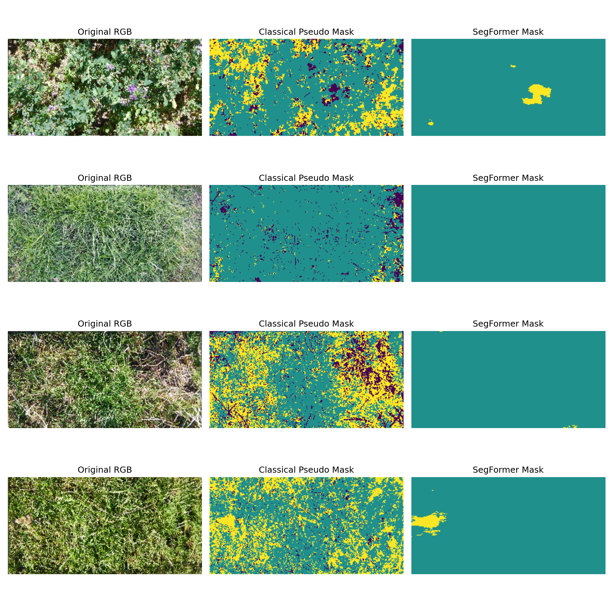
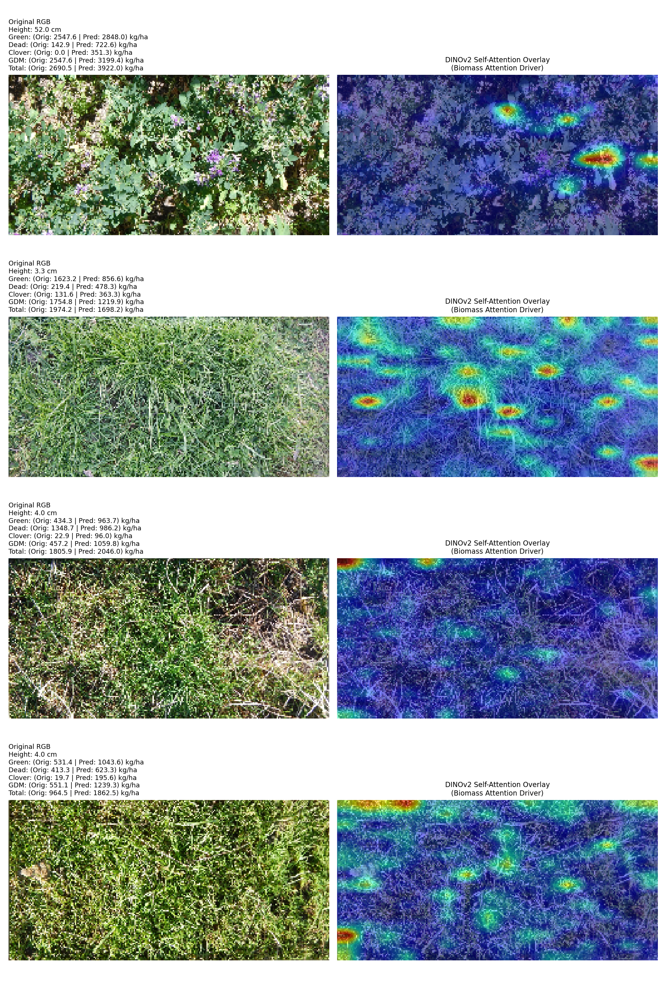

# 🌿 Pasture Biomass Predictor

[](https://share.streamlit.io/)
[](https://www.python.org/)
[](https://pytorch.org/)
[](https://huggingface.co/)
[](https://scikit-learn.org/)

An interactive **Machine Learning & Computer Vision** dashboard to predict pasture dry matter fractions and total biomass from RGB images and sensor metadata. This project leverages state-of-the-art **Vision Foundation Models** alongside tabular regression techniques to estimate yields accurately and provide explainable visual insights.

---

## 🚀 Key Features

* **Multi-Modal Feature Fusion**: Integrates deep visual features with field-collected metadata (NDVI, Canopy Height) for robust regression.
* **Vision Foundation Models**:
  * **SegFormer (NVIDIA)**: Performs semantic segmentation to estimate green vegetation vs. soil/dead matter ratio.
  * **Depth Anything**: Computes monocular depth maps to extract canopy height and volumetric proxies.
  * **DINOv2 (Meta AI)**: Extracts high-fidelity self-supervised embeddings representing texture, density, and health.
* **Explainable AI (XAI)**: Generates DINOv2 self-attention maps to visualize which regions of the pasture are driving the biomass predictions.
* **Interactive Dashboard**: User-friendly Streamlit interface for uploading pasture images, adjusting parameters, and viewing real-time predictions.

---

## 🛠️ System Architecture



---

## 📦 Installation & Setup

### 1. Clone the Repository
```bash
git clone https://github.com/Nayan-cod/Image-to-Biomass-Prediction.git
cd Image-to-Biomass-Prediction
```

### 2. Install Dependencies
Make sure you have Python 3.8+ installed. Install the required packages using:
```bash
pip install -r requirements.txt
```

### 3. Place Model Weights
Since large model files are excluded from Git (via `.gitignore`), ensure you have your trained regressor and model info in the root directory:
* `best_regressor.joblib`
* `best_model_info.pkl`

---

## 🖥️ Running the Application

Start the interactive Streamlit dashboard locally:
```bash
streamlit run app.py
```
The app will open automatically in your browser at `http://localhost:8501`.

---

## 📊 Visualizations & QA

### Pasture Segmentation
The pipeline uses SegFormer to segment the pasture into green vegetation and soil/dead material, allowing the model to calculate exact coverage ratios:



### Explainability (Attention Maps)
Using DINOv2's self-attention, the dashboard overlays a heatmap showing which parts of the pasture contributed most to the final biomass prediction:



---

## 📝 Disclaimer
Predictions are statistical estimates generated by computer vision and regression models trained on the CSIRO Image2Biomass dataset. They represent approximate yields and are not lab-grade measurements.
